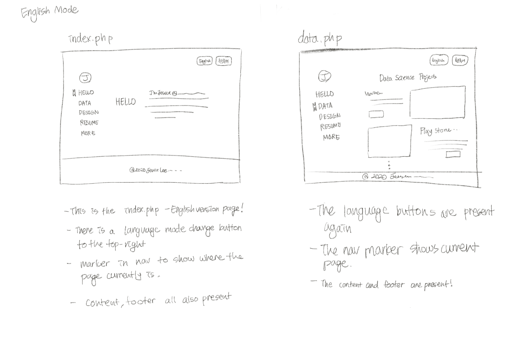
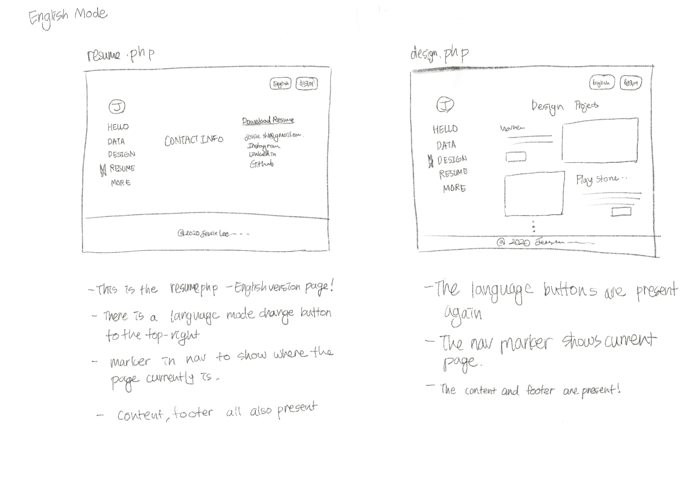
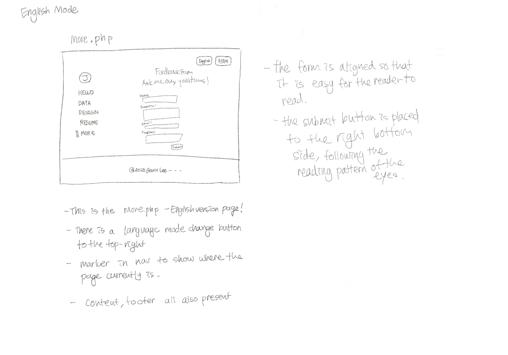
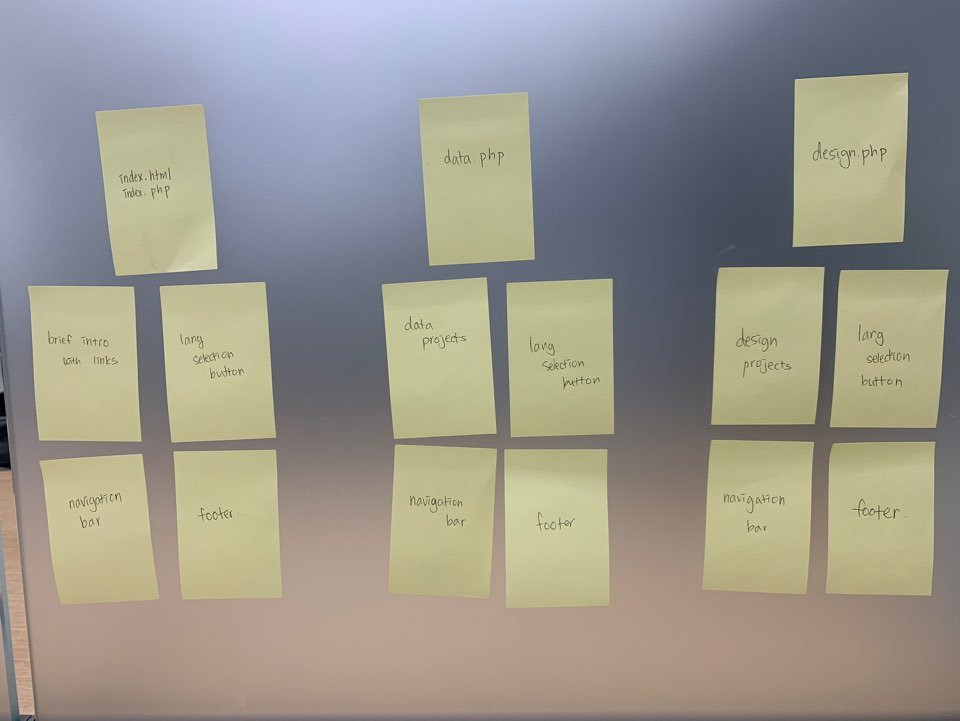
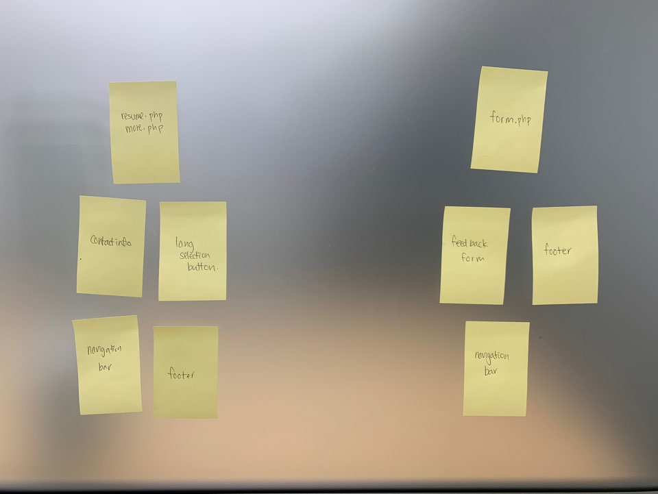
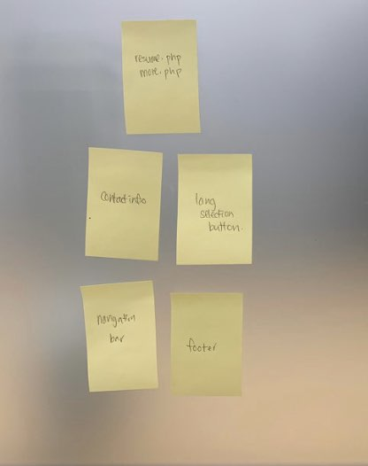
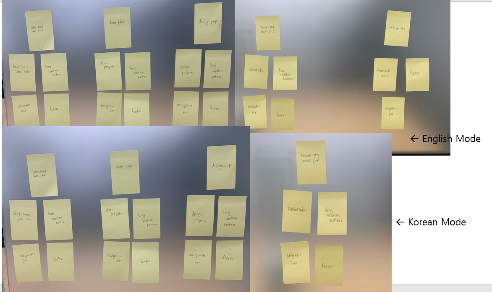
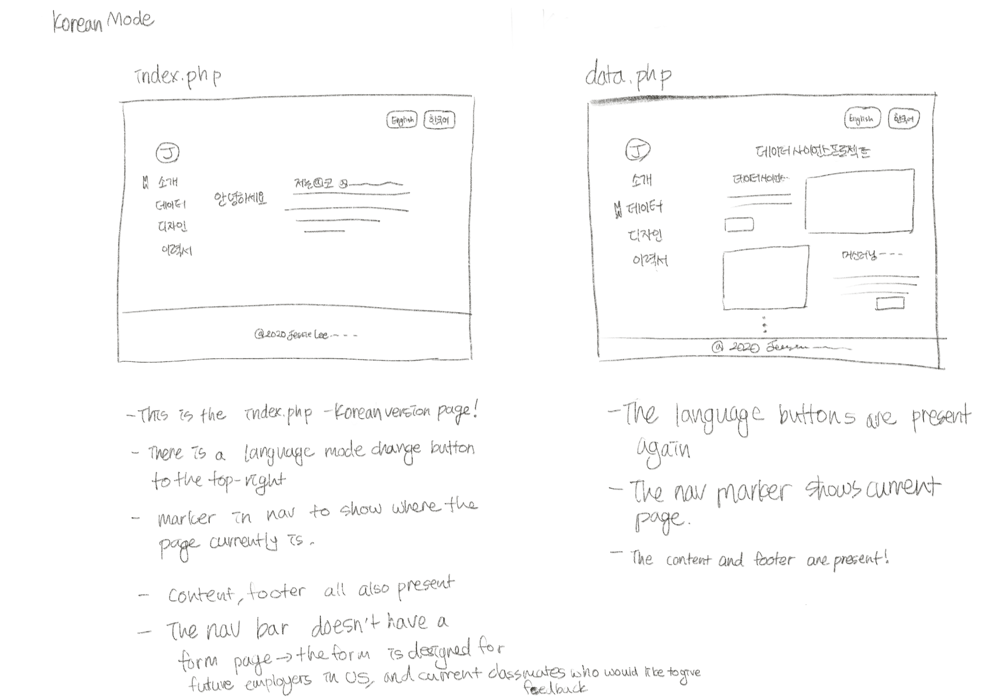

# Project 1: Design Journey

Be clear and concise in your writing. Bullets points are encouraged.


**Everything, including images, must be visible in Markdown Preview.** If it's not visible in Markdown Preview, then we won't grade it. We won't give you partial credit either. This is your warning.

## Existing Design, Planning, & Refined Design (Milestone 1)

### Existing Site: Target Audience I (Milestone 1)

The target audience of my site are future employers in the US looking for a data scientist to hire.

### Existing Site: Target Audience I Needs (Milestone 1)

- Need #1: [Contact Info]
  - **Need**
    - >My existing target audience needs information on how to contact me if they are interested in
    doing so.
  - **Design Choices**
    - > I devoted a section to my website that contains all my contact information. It has links to
    github, linkedin, resume and email addresses. It is minimalistic and focuses on showing the exact information that users would want to know.
- Need #2: [Professional Ability]
  -   - **Need**
    - >My existing target audience need to know my skillsets and ability in order to determine whether or not they will hire me.
  - **Design Choices**
    - > Since this is crucial information for my website users to know, I have made the access to this information pretty clear. I used a minimalistic design for the access to be easy.
    I have made two pages in my website that show my data science projects and my design projects.
    This will help them grasp an idea of who I am and help them make their decision in hiring me or not.

- Need #3: [Basic Information]
   -   - **Need**
    - >My existing target audience would proabably like to know basic information on who I am. Such as what school I go to, what my major is ... etc.
  - **Design Choices**
    - > Since this is information that employers might me curious at first, I have included this in the main page of my website. The main page of my website describes what school i go too, what my major is and the field I am interested in.
- etc.
- Need #4: [FEEDBACK]
  - **Need**
    - > A form to review give feedback on parts of the website they thought were still problematic.I have included this only for the English mode of my website because I am currently in the US and will show my website mainly to people who speak English.
  - **Design Ideas and Choices**
    - > The form will include elements like rating, and parts that they thought needed improvement, and parts that did not work.


### Existing Site: Design/Sketches (Milestone 1)





-index.html:
            The nav bar is located in the left while the rest of the content is located in the right.
            'HELLO' is the title of the page. The rest of the content is an introduction to who I am.
             The introduction includes links to github and recent projects that I am working on.

-data.html and design.html:
            The nav bar is located in the left while the rest of the content is located in the right.
            The content shows the data projects. There is an image that describes the project and a brief
            description of the project. The more button leads to further description of the project.

-resume.html:
            The nav bar is located in the left while the rest of the content is located in the right.
            'CONTACT INFO' is the title of the page and just describes what this page is about.
            The content changes color when each element('Download Resume', 'jessielee.shl@gmail.com','Instagram'....) is hovered over. When one clickes an element, it leads to the correspnding page that each element is describing.


### Refined Site: Target Audience II (Milestone 1)
> Who is your additional/secondary target audience?
My secondary target audience is future employers in Korea, who need a korean version of my website to understand the content

### Refined Site: Target Audience II Needs (Milestone 1)

- Need #1: [language]
  - **Need**
    - > My audience needs a korean language version of my website
  - **Design Ideas and Choices**
    - > I will add a button to my website that will change its mode when I press on it to Korean.
- Need #2: [FONT SIZE]
  - **Need**
    - > My audience needs a clear font and large enough font size for them to be able to read the content of the page.
  - **Design Ideas and Choices**
    - > The nav bar and the font website seems to be a little bit too small for everyone to be able to clearly understand the page. Therefore I am going to use the font Tahoma in order to make it easier for the users to read.
- Need #3: [HOVER]
  - **Need**
    - > There are many parts of my page that lead to links but do not look like links at all.
  - **Design Ideas and Choices**
    - > I should make it more clear to the people that these parts of the website lead to links in the page. I will add background colors to the nav bars and to the part of the content that have links.


### Refined Site: Content Organization/Navigation (Milestone 1)
> Identify the content that is necessary for both target audiences.
> List the content here.
> Don't forget to include the form.

- The Home page with the Hello title. (index.html)
      - the nav bar
      - the footer
      - the button that switches the mode from basic to accesbility mode.
- The Data page with the Data Projects title (data.html)
      - the nav bar
      - the project contents.
- The Design page with the Design Projects title (design.html)
      - the nav bar
      - the project contents.
- The Resume page with the Contact information (resume.html)
      - the nav bar
      - the footer
      - the contact information

> Organize the content for the target audience and identify possible pages for the content using card sorting.
> First, organize the content for target audience I. Document your card sorting by taking a photo and including it here.



> Second, organize the content for target audience II. Document your card sorting by taking a photo and including it here.



> Next, organize the content for both target audiences. Document your card sorting by taking a photo and including it here.


> Lastly, list the pages that resulted from your final card sort (i.e. your site's navigation).

- select mode
- basic mode
    - The Home page with the Hello title. (index.html)
      - the nav bar
      - the footer
      - the button that switches the mode from basic to accesbility mode.
    - The Data page with the Data Projects title (data.html)
      - the nav bar
      - the project contents.
    - The Design page with the Design Projects title (design.html)
      - the nav bar
      - the project contents.
    - The Resume page with the Contact information (resume.html)
      - the nav bar
      - the footer
      - the contact information

### Refined Site: Design (Milestone 1)
> Refine the design of your site to meet the needs of _both_ target audiences.
> Include sketches of each page of the refined design.
> Provide a brief explanation _underneath_ each sketch.
> Document your _entire_ design process. **Show your preliminary sketches and your final sketches.**
> Don't forget the form and confirmation page!



### Partial Plan (Milestone 1)
> Using your refined sketches, plan your site's partials.
> You may describe each partial or sketch it. It's up to you!

1) Partial 1
  Navigation Bar
  : This partial will show the nav bar on call and mark which page the user is currently on in the nav bar

  * This partial will call different nav bars depending on the language that is selected.
  For example, if Korean is selected it will show the korean nav bar and if english is selected, it will show the english nav bar.

2) Partial 2
Footer
  : This partial will show the footer on call.


---

## Sticky Form Planning (Milestone 2)

### Sticky Form (Milestone 2)
> What controls do you need for your form?
- I need a name input, email input, question and feedback input
- All the information that will be inputed in this form is required so there needs to be a
feature within the website that validates whether or not all the input has been put in.
-If there are missing inputes, the form needs to display an error meesage.
-There should be a submit button
-The results of input should be shown when submit is pressed.
> Plan out your feedback messages for your form. You may sketch (probably the easiest) or write it out.
-"Please provide your name! :)"
-"Please ask me any question! :)"
-"Please provide valid email for a response to your question! :)"

> How does this form meet the needs of at least one of your target audiences (specify which)?
- This meets the need of my target audience who are future employers in the US. They may have a question they want to ask me or provide feedback to a budding data scienctist. To fullfill this need, this form allows them to contact me with any questions they may have and  can provide me with feedback on what I should change for my website.

### Validation Code Plan (Milestone 2)
> Write out your pseudocode plan for handling the validation of the form.

```
<!-- index.php -->
      //check if language is english and set the default of the site to english.
      //if it is english, call title attribute in en.php lang array
      //check if language is korean
      //if it is korean, call title attribute in ko.php lang array

    //set hello to active so that it will activate hello nav bar on the index.php page
      $hello = "active";
      //call right nav depending on language
      //if the language is empty, set the default of it to english
                if language is empty or language is english
                      call english nav in en.php
                    else if language is korean
                      call korean nav in kor.php
      //call right main title depending on language
                    if language is empty or language is english
                      call english title in en.php
                    else if language is korean
                      call korean title in kor.php
      //call right intro depending on language
                    if language is empty or language is english
                      call english intro in en.php
                    else if language is korean
                      call korean intro in kor.php

      // call footer.php using include() function
      //define the footer in footer.php


<!-- data.php -->
      //check if language is english and set the default of the site to english.
      //if it is english, call title attribute in en.php lang array
      //check if language is korean
      //if it is korean, call title attribute in ko.php lang array

    //set hello to active so that it will activate hello nav bar on the index.php page
      $data = "active";
      //call right nav depending on language
      //if the language is empty, set the default of it to english
                if language is empty or language is english
                      call english nav in en.php
                    else if language is korean
                      call korean nav in kor.php
      //call right main title depending on language
                    if language is empty or language is english
                      call english title in en.php
                    else if language is korean
                      call korean title in kor.php
      //call right projects depending on language
                    if language is empty or language is english
                      call english projects in en.php
                    else if language is korean
                      call korean projects in kor.php
      // call footer.php using include() function
      //define the footer in footer.php

<!-- design.php -->
      //check if language is english and set the default of the site to english.
      //if it is english, call title attribute in en.php lang array
      //check if language is korean
      //if it is korean, call title attribute in ko.php lang array

    //set hello to active so that it will activate hello nav bar on the index.php page
      $design = "active";
      //call right nav depending on language
      //if the language is empty, set the default of it to english
                if language is empty or language is english
                      call english nav in en.php
                    else if language is korean
                      call korean nav in kor.php
      //call right main title depending on language
                    if language is empty or language is english
                      call english title in en.php
                    else if language is korean
                      call korean title in kor.php
      //call right projects depending on language
                    if language is empty or language is english
                      call english projects in en.php
                    else if language is korean
                      call korean projects in kor.php
     // call footer.php using include() function
      //define the footer in footer.php

<!-- resume.php -->
      //check if language is english and set the default of the site to english.
      //if it is english, call title attribute in en.php lang array
      //check if language is korean
      //if it is korean, call title attribute in ko.php lang array

    //set hello to active so that it will activate hello nav bar on the index.php page
      $hello = "active";
      //call right nav depending on language
      //if the language is empty, set the default of it to english
                if language is empty or language is english
                      call english nav in en.php
                    else if language is korean
                      call korean nav in kor.php
      //call right main title depending on language
                    if language is empty or language is english
                      call english title in en.php
                    else if language is korean
                      call korean title in kor.php
      //call right intro depending on language
                    if language is empty or language is english
                      call english intro in en.php
                    else if language is korean
                      call korean intro in kor.php
      // call footer.php using include() function
      //define the footer in footer.php

<!-- form.php -->
      //check if language is english and set the default of the site to english.
      //if it is english, call title attribute in en.php lang array
      // call footer.php using include() function
      //define the footer in footer.php

---

## Complete & Polished Website (Final Submission)

### Target Audiences (Final Submission)
> Tell us how your final site meets the needs of the target audiences. Be specific here. Tell us how you tailored your design, content, etc. to make your website usable by both target audiences.

My final site meets the needs of my two target audiences.
My first target audience was future employers in the US. These people would like to know the content of my website to determine whether or not I have the right skills to be employed for the job. Other than that, they would probably also like to know my contact information if they want to contact me about inquiries they have or if they have decided to employ me. Also, during my time searching for internships and job opportunities, I have found that many employers like to offer some feedback to budding data scientists and newcomers into this industry. To fill this need, I decided to add a form in the more section of my nav bar to that these future employers could offer me with some feedback.

My second target audience is future employers in Korea, for these people it would be easier for them to read the content of my website in Korean. To fufill this need, I have decided to add a button to my website that will change the content of my website to Korean. This will help them understand the content of my website more easily. This will help them judge whether or not I have the right skills to be employed for the job. Just like my first target audience, this audience would also like to know the contact information if they would like to contact me about any of these job opportunities.

### Additional Design Justifications (Final Submission)
> If you feel like you haven’t fully explained your design choices in the final submission, or you want to explain some functions in your site (e.g., if you feel like you make a special design choice which might not meet the final requirement), you can use the additional design justifications to justify your design choices. Remember, this is place for you to justify your design choices which you haven’t covered in the design journey. You don’t need to fill out this section if you think all design choices have been well explained in the design journey.
I have used a nav bar that is placed in the left hand side vertically to tryout a format that isn't typically used. I think this is a unique design aspect that will help the users of my site remember the design of my website more easily.

I have also tried to keep the design of my website simple by using simplistic and minimalistic designs. I tried to use a minimum amount of colors and keep the color code consistent.
I have specifically used green because it is the color that is scienctifically proven to be the most easing for the eye. by doing this, I believe that I have somehow contributed to making my website accessible for those who have trouble staring at a computer screen for long hours.

### Self-Reflection (Final Submission)
> Reflect on what you learned during this assignment. How have you improved from 1300? What things did you have trouble with?
I have challenged myself by creating a language change button just with php. I have improved from INFO 1300 not just by being able to implement more enhanced designs to my website but also by challenging myself to try design and code goals. I had trouble with making the code work to change the language and learned to importance of being meticulous when you code to make sure that there aren't aspects of it that are wrong.
